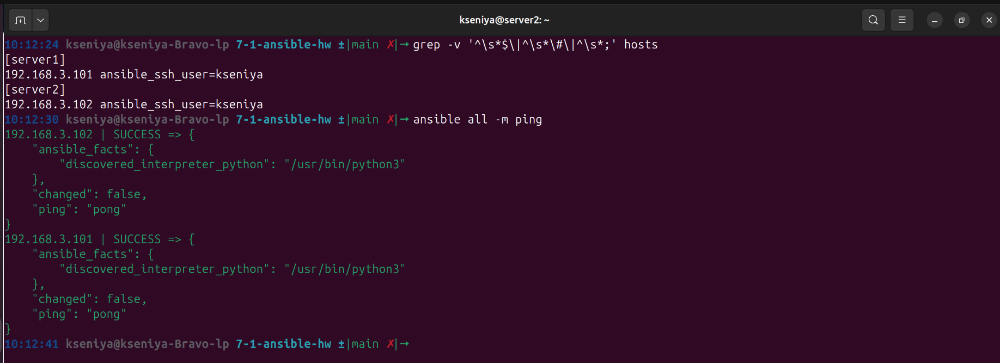
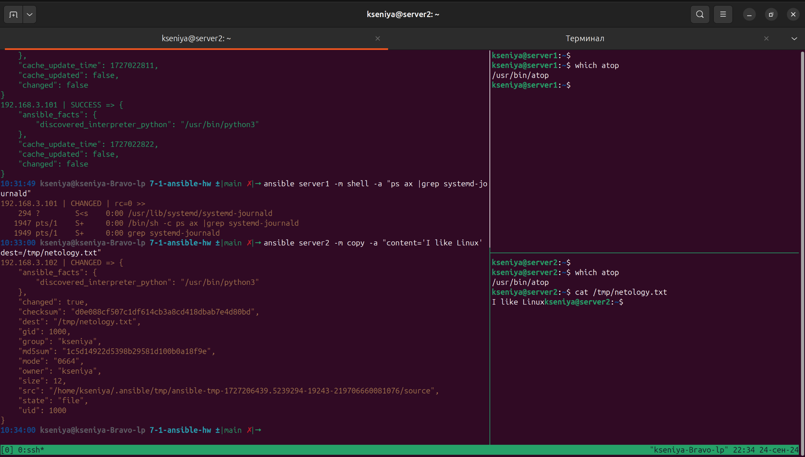

# Домашнее задание к занятию "`Ansible. Часть 1`" - `Politiko Kseniya`

### Задание 1

`Ответьте на вопрос в свободной форме.

Какие преимущества даёт подход IAC?

Основные преимущества IaC:

Развёртывание: отказ от ручного взаимодействия с облачными провайдерами повышает скорость развёртывания.

Восстановление: выявление проблем в конфигурации обеспечивает быстрое восстановление после сбоев.

Последовательность: каждый раз ресурсы развёртываются одинаково, что уменьшает уязвимость инфраструктуры.

Модификация: изменение ресурсов требует меньшего оборотного времени.

Возможность повторного использования: можно повторно использовать части текущей инфраструктуры в будущих проектах.

Контроль версий: код инфраструктуры хранится в системах контроля версий.

Визуальный доступ: создавая конфигурацию в виде кода, можно получить документацию для инфраструктуры.

### Задание 2

Выполните действия и приложите скриншоты действий.

1. Установите Ansible.
2. Настройте управляемые виртуальные машины, не меньше двух.
3. Создайте файл inventory с созданными вами ВМ.
4. Проверьте доступность хостов с помощью модуля ping.
`

---

### Задание 3

Ответьте на вопрос в свободной форме.

Какая разница между параметрами forks и serial?

forks и serial являются параметрами, которые часто используются в контексте программирования и параллельных вычислений. Вот их основные различия:

forks: В контексте программирования, forks обычно относится к процессу создания нового процесса (дочернего процесса) из существующего процесса (родительского процесса). При использовании параллельных вычислений, forks относится к созданию нескольких потоков выполнения, которые работают параллельно и независимо друг от друга. Каждый поток выполняет свою задачу в отдельности, что позволяет повысить производительность и эффективность.

serial: Serial относится к последовательному выполнению задач или операций, то есть выполнению в одном потоке без параллельных вычислений или конкурентных операций. Когда задачи или операции выполняются последовательно, они исполняются один за другим, в определенном порядке, без параллельных или одновременных действий.

Упрощённо говоря, в следующих настройках:
* **serial** — это количество серверов, которые будут подключаться на каждой итерации воспроизведения.
* **fork** — максимальное количество ssh-подключений, которые может контролировать контроллер в рамках одного задания.

### Задание 4

В этом задании вы будете работать с Ad-hoc коммандами.

Выполните действия и приложите скриншоты запуска команд.

Установите на управляемых хостах любой пакет, которого нет.
Проверьте статус любого, присутствующего на управляемой машине, сервиса.
Создайте файл с содержимым «I like Linux» по пути /tmp/netology.txt.

`
